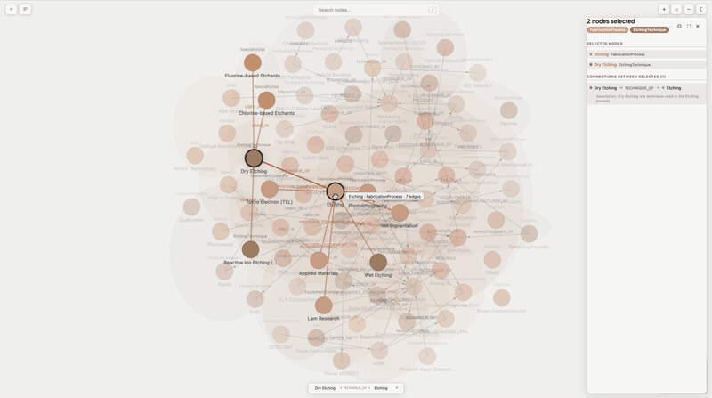

# Backpack

**Carry your knowledge forward.**

LLMs are incredible at reasoning but have zero memory of your world. Every new conversation starts from scratch — you repeat clients, projects, decisions, and preferences over and over.

Backpack fixes that. It gives your AI a persistent, structured knowledge base that carries forward across every session.


## What it does

Tell your AI something once, and it remembers — next conversation, next week, next month.

```
You: "We just signed Acme Corp, they're on the Enterprise tier, main contact is Sarah Chen"

Claude: [saves to backpack → clients learning graph]

--- weeks later, different conversation ---

You: "What do we know about Acme Corp?"

Claude: "Acme Corp is on the Enterprise tier, main contact is Sarah Chen..."
```

No copy-pasting. No re-explaining. Your knowledge carries forward.

## The graph viewer

An interactive canvas where you can actually see and explore your knowledge base.



- Force-directed layout with live updates as you add knowledge
- Click nodes to explore relationships, properties, and connections
- Focus mode to zoom into a subgraph, walk mode to trace paths between ideas
- Type hulls group related things visually
- Vim-style keyboard navigation, undo/redo, search

This is where human understanding meets AI-generated knowledge — turning structured data into something you can see, navigate, and build on.

[Backpack Viewer repo](https://github.com/NoahIrzinger/backpack-viewer)

## Get started

### Recommended: Backpack App (free cloud account)

Sign up for a free account at [app.backpackontology.com](https://app.backpackontology.com), then add Backpack to Claude Code:

```bash
claude mcp add backpack-app -s user --transport sse https://app.backpackontology.com/mcp/sse
```

Your knowledge syncs across devices, you can share with your team, and you get access to the web-based graph visualizer. On first run, a browser window opens for sign-in. After that, it's automatic.

### Backpack Local (offline, private)

Prefer to keep everything on your machine? No account needed.

**If you're using Claude Code, install the plugin** — it bundles this MCP server together with two usage skills that teach Claude how to build and query learning graphs, including an autonomous mining loop for growing a graph from web sources:

```
/plugin marketplace add NoahIrzinger/backpack-ontology-plugin
/plugin install backpack-ontology@NoahIrzinger-backpack-ontology-plugin
```

Restart Claude Code (or run `/reload-plugins`) and you're ready. Plugin repo: [backpack-ontology-plugin](https://github.com/NoahIrzinger/backpack-ontology-plugin).

**Without the plugin (advanced, or other MCP clients):**

```bash
claude mcp add backpack-local -s user -- npx backpack-ontology@latest
```

This installs the MCP server directly but without the skills. You'll have the tools but not the guidance on how Claude should use them — the plugin is recommended unless you have a specific reason to skip it.

You can always move to Backpack App later by telling Claude "sync my backpack to the cloud".

### Works with other AI tools

Backpack works with any tool that supports MCP. Here's how to set it up:

<details>
<summary><strong>Cursor</strong></summary>

Add to `~/.cursor/mcp.json` (or `.cursor/mcp.json` in your project):

```json
{
  "mcpServers": {
    "backpack": {
      "command": "npx",
      "args": ["backpack-ontology@latest"]
    }
  }
}
```

Or configure through Cursor Settings > MCP.
</details>

<details>
<summary><strong>Windsurf</strong></summary>

Add to `~/.codeium/windsurf/mcp_config.json`:

```json
{
  "mcpServers": {
    "backpack": {
      "command": "npx",
      "args": ["backpack-ontology@latest"]
    }
  }
}
```
</details>

<details>
<summary><strong>OpenAI Codex CLI</strong></summary>

```bash
codex mcp add backpack -- npx backpack-ontology@latest
```

Or add to `~/.codex/config.toml`:

```toml
[mcp_servers.backpack]
command = "npx"
args = ["backpack-ontology@latest"]
```
</details>

<details>
<summary><strong>Cline (VS Code)</strong></summary>

Click the MCP Servers icon in Cline's top bar, then add:

```json
{
  "mcpServers": {
    "backpack": {
      "command": "npx",
      "args": ["backpack-ontology@latest"]
    }
  }
}
```
</details>

<details>
<summary><strong>Continue.dev</strong></summary>

Add to `~/.continue/config.yaml`:

```yaml
mcpServers:
  - name: backpack
    command: npx
    args:
      - "backpack-ontology@latest"
```
</details>

<details>
<summary><strong>Zed</strong></summary>

Add to `~/.config/zed/settings.json`:

```json
{
  "context_servers": {
    "backpack": {
      "command": "npx",
      "args": ["backpack-ontology@latest"]
    }
  }
}
```

Note: Zed uses `context_servers`, not `mcpServers`.
</details>

### Switching from Backpack Local to Backpack App

Already using Backpack Local and want to move to the cloud? One command uploads everything:

> "Sync my backpack to the cloud"

Then add the cloud MCP server and you're done.

## What to say to Claude

No commands to learn. Just talk naturally.

### Remember something

> "Remember that Acme Corp is on the Enterprise tier, main contact is Sarah Chen"

> "Add our new vendor agreement details to backpack"

> "Start a learning graph for our hiring process"

### Find something

> "What's in my backpack about Acme Corp?"

> "Search backpack for anything related to compliance"

> "What do we know about the deployment process?"

### See the big picture

> "Show me my learning graph"

> "What's in my backpack?"

> "Describe the clients graph"

Claude will open the graph visualizer so you can explore your knowledge visually.

## What people use it for

- **Client management**: keep track of accounts, contacts, contract details, and conversations across sessions
- **Process documentation**: capture how things are done so Claude can help consistently every time
- **Project knowledge**: architecture decisions, vendor relationships, compliance requirements
- **Domain expertise**: industry terminology, regulatory frameworks, best practices
- **Team onboarding**: new team members get Claude with your organization's context already loaded

## How it works

You have one backpack. It goes everywhere with you. Inside it, you organize knowledge into **learning graphs**, each covering a different topic (clients, processes, compliance, etc.). Within each graph, information is stored as things connected by relationships. You don't need to think about the structure. Claude handles it automatically.

## Token efficiency

Backpack uses progressive disclosure — it never loads the full graph into context. Each tool returns only what's needed.

Here's what a typical interaction looks like against a real 81-node graph (~12,000 tokens if loaded raw):

| What the AI does | Tokens returned | % of full graph |
|---|---|---|
| Describe structure | ~2,478 | 20% |
| Search for a topic (17 results) | ~429 | 3% |
| Get one node's full details | ~154 | 1% |

A describe → search → get_node interaction uses **~3,000 tokens** instead of ~12,000. For smaller graphs (13 nodes, ~1,700 tokens), the savings are smaller because the metadata is a larger fraction of total data.

Results vary by graph size and operation. Node lookups and searches consistently use under 5% of the full graph. Describe uses 20–67% depending on graph size. Run the benchmark on your own graphs:

```bash
npx -p backpack-ontology@latest backpack-benchmark
```

Across sessions, the real value is that the graph exists at all. It's built once and queried forever — every future conversation uses structured lookups instead of re-explaining context from scratch.

## Data and privacy

**Backpack Local**: your data is stored at `~/.local/share/backpack/graphs/<graph-name>/` as an append-only event log per branch (`branches/<branch>/events.jsonl`) plus a materialized snapshot cache (`branches/<branch>/snapshot.json`). Both are human-readable, backupable, and version-controlable. Graphs from earlier versions are migrated to this format automatically on first start — nothing to do.

**Backpack App**: your data is stored securely in our cloud infrastructure. See our [privacy policy](https://backpackontology.com/privacy) for details.

**Telemetry**: Backpack collects anonymous usage statistics (tool counts, session duration) to improve the product. No content, names, or personal data is ever collected. Opt out with `DO_NOT_TRACK=1`.

## Reference

### CLI commands

| Command | What it does |
|---|---|
| `npx backpack-ontology@latest` | Start the Backpack Local MCP server |
| `claude mcp add backpack-app ... --transport sse` | Connect to Backpack App cloud MCP |
| `npx -p backpack-ontology@latest backpack-sync` | Upload local learning graphs to Backpack App |
| `npx backpack-viewer` | Open the graph visualizer (http://localhost:5173) |
| `npx -p backpack-ontology@latest backpack-init` | Remove any leftover Backpack hooks from `.claude/settings.json` |

### Multiple backpacks

A **backpack** is a named directory of learning graphs. Most users start with one (`personal`, auto-created at `~/.local/share/backpack/graphs/`) and never touch the registry. But you can register additional backpacks — a shared OneDrive folder with a colleague, a project-specific directory, a family-shared set of notes — and **switch between them** with a single command. Only one backpack is active at a time; all reads and writes go to the active one.

Say to Claude:

> "Register a backpack called 'work' at /Users/me/OneDrive/work-backpack and switch to it."

> "Which backpack am I in?"

> "Switch to the personal backpack."

The viewer shows the active backpack in the sidebar header with a colored indicator — click it to switch. Config (machine ID, telemetry, remote cache) stays per-user; only the graphs directory is shared.

### Tools

Claude uses these automatically. You don't need to call them directly.

| What Claude does | How |
|---|---|
| Manage backpacks | `backpack_register`, `backpack_switch`, `backpack_active`, `backpack_registered`, `backpack_unregister` |
| See what's in the backpack | `backpack_list`, `backpack_describe` |
| Add a new learning graph | `backpack_create` |
| Find something | `backpack_search`, `backpack_list_nodes` |
| Get full details on an item | `backpack_get_node`, `backpack_get_neighbors` |
| Add or update knowledge | `backpack_import_nodes` (preferred, with always-on validation), `backpack_add_node`, `backpack_update_node`, `backpack_add_edge` |
| Audit and clean up drift | `backpack_audit`, `backpack_audit_roles`, `backpack_normalize`, `backpack_health` |
| Snapshot and revert | `backpack_snapshot`, `backpack_versions`, `backpack_rollback`, `backpack_diff` |
| Branches | `backpack_branch_create`, `backpack_branch_switch`, `backpack_branch_list` |
| Collaboration awareness | `backpack_lock_status` (reads the current edit heartbeat on shared graphs) |
| Delete | `backpack_remove_node`, `backpack_remove_edge`, `backpack_delete` |

**Autonomous mining** (plugin-only): the `backpack-mine` skill in the [Claude Code plugin](https://github.com/NoahIrzinger/backpack-ontology-plugin) drives an iteration loop that finds sources on the web, extracts entities and relationships, validates each batch, and stops on convergence. Say "mine &lt;topic&gt; into a learning graph" and the skill takes over.

### Configuration

| Variable | Effect |
|---|---|
| `XDG_DATA_HOME` | Change local data location (default: `~/.local/share`) |
| `BACKPACK_DIR` | Override all Backpack directories |
| `DO_NOT_TRACK` | Disable anonymous telemetry |

## Support

Questions, feedback, or partnership inquiries: **support@backpackontology.com**

## License

Licensed under the [Apache License, Version 2.0](./LICENSE).

## Contributing

Issues and pull requests are welcome on [GitHub](https://github.com/noahirzinger/backpack-ontology).
